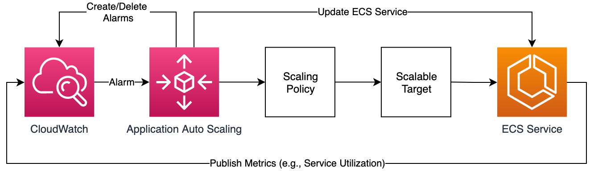

# Pulumi ECS Fargate Example

This project demonstrates how to deploy **Web UI** and **Web API** services on **AWS Fargate** using **Pulumi**.

The ECS services are configured to run in a **public subnet** for the Web UI and a **private subnet** for the Web API. Communication between the Web UI and Web API services

Note: Depends on the Application requirement, we can use EC2 as backend, if we need to store any volumes

The below diagram is the sample diagram which I took from the official AWS, the code is created based on that in pulumi.




## Prerequisites

Before you begin, you need to have the following installed and configured:

- [Node.js](https://nodejs.org/) (>= 14.x)
- [Pulumi](https://www.pulumi.com/docs/get-started/install/) (>= 3.x)
- [AWS CLI](https://docs.aws.amazon.com/cli/latest/userguide/install-cliv2.html)
- AWS account with appropriate permissions


## Steps to Deploy Infrastructure

### 1. Preview Changes (`pulumi preview`)

Before applying any changes, you can preview what will happen to your cloud infrastructure. This will show the resources that will be created, updated, or deleted.

Run the following command to review the changes:
```pulumi preview```

2. Apply Changes (pulumi up) to prod
    ```pulumi up --stack prod```

 
3. Verify Deployment(After running pulumi up, you can verify the status of your infrastructure by using the pulumi stack command:
)

   pulumi stack

# How to Run

install docker on your machine: [Install Docker](https://docs.docker.com/engine/install/)


Open terminal and run:
```
docker-compose up
```

Open a web browser and navigate to 
```
http://localhost:3000
```


# Application Details

- Web: ASP.NET Core 5.0 Web APP
  - `this application requires an environment variabled called "ApiAddress" which will be the address of the Web Api.`
- API: ASP.NET Core 5.0 Web API


